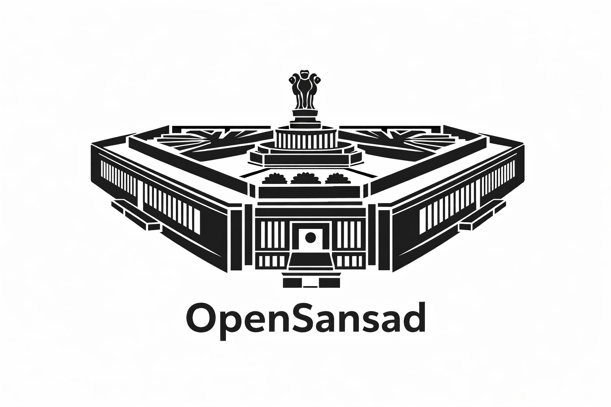
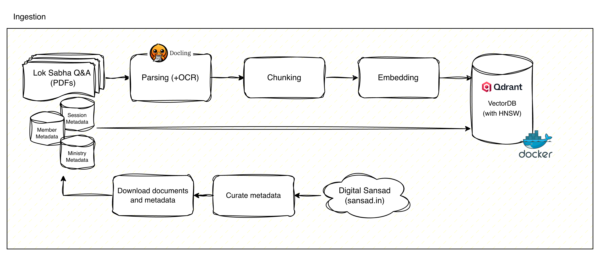

<p align="center">
  
</p>

<h1 align="center">OpenSansad — Lok Sabha Q&A Dataset</h1>

<p align="center">
  A structured dataset of Indian Lok Sabha parliamentary question-and-answer records for NLP research and transparency.
</p>

<p align="center">
  <a href="https://huggingface.co/datasets/opensansad/lok-sabha-qa">View on HuggingFace</a>
</p>

Part of the **OpenSansad** initiative — a personal project to make Sansad's (Indian Parliament's) workings more accessible and transparent through open data and open-source tooling. Data sourced from [Digital Sansad](https://sansad.in/).

## Dataset at a Glance

| | 18th Lok Sabha | 17th Lok Sabha |
|---|---|---|
| **Period** | 2024–2026 | 2019–2024 |
| **Sessions** | 2–7 | 1–15 |
| **Questions** | 27,224 | 60,549 |
| **Text extracted** | 27,223 | 55,700 (sessions 1–12) |
| **Unique MPs** | 466 | 505 |

**Total: 87,700+ records** across 64 ministries covering both starred (oral) and unstarred (written) parliamentary questions.

## Quick Start

```python
from datasets import load_dataset

ds = load_dataset("opensansad/lok-sabha-qa")

# Filter by ministry
health = ds["train"].filter(lambda x: "HEALTH" in (x["ministry"] or ""))

# Filter by Lok Sabha and session
lok18_s4 = ds["train"].filter(lambda x: x["lok_no"] == 18 and x["session_no"] == 4)

# Starred questions only
starred = ds["train"].filter(lambda x: x["type"] == "STARRED")
```

## Pipeline

This repo contains the full data pipeline — self-contained, no external dependencies:



```
1. Curate   →  Fetch metadata from sansad.in API
2. Download →  Download source PDFs
3. Extract  →  Extract text from PDFs (Docling + EasyOCR fallback)
4. Build    →  Assemble into Parquet dataset
5. Publish  →  Push to HuggingFace Hub
```

### Setup

```bash
uv sync
```

### Run the pipeline

```bash
# 1. Curate metadata for a Lok Sabha
uv run python -m lok_sabha_dataset.pipeline.curate --lok 18

# 2. Download PDFs
uv run python -m lok_sabha_dataset.pipeline.download run --lok 18

# 3. Extract text from PDFs (two-pass for speed)
uv run python -m lok_sabha_dataset.pipeline.extract run --lok 18 --engine docling
uv run python -m lok_sabha_dataset.pipeline.extract run --lok 18 --engine easyocr --retry-empty

# 4. Build parquet (auto-discovers all loks in data/)
uv run python -m lok_sabha_dataset.build

# 5. Publish to HuggingFace
uv run python -m lok_sabha_dataset.publish --push
```

### Build specific sessions

```bash
uv run python -m lok_sabha_dataset.build --lok 18 --sessions 6-7
```

Output is written to `output/lok_sabha_qa.parquet`.

## Configuration

Override the data directory via environment variable:

```bash
export LOKSABHA_DATA_DIR=/path/to/data
```

Default is `data/` in the repo root.

## Related

- **[lok-sabha-rag](https://github.com/sammitjain/lok-sabha-rag)** — RAG application built on this dataset for querying parliamentary proceedings
- **[opensansad/lok-sabha-qa](https://huggingface.co/datasets/opensansad/lok-sabha-qa)** — The published dataset on HuggingFace
